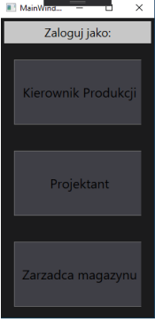
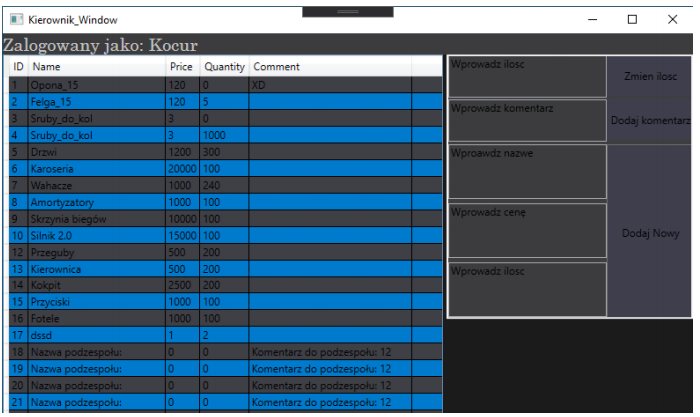
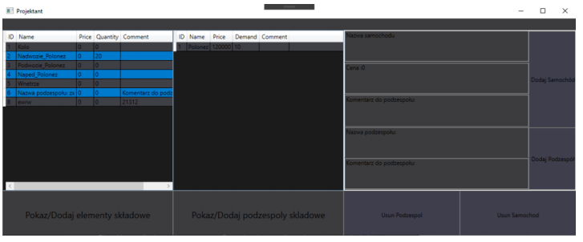

# Car Factory - Simple database app
## General info
App was done as part of the course of database course at studies.  
It is a system that helps in factory inventory management.
## Roles in system
- Warehouse manager-can update quantitty of parts.
- Designer - can bind parts to subsystems and cars. In other words he makes new models of cars.
## Weak points
- No prevention of SQL injection. It is easy to solve by using parameterized queries.
- Passwords are not hashed. The easiest way to do that is to use MD5 alghorithm.
## Screens from app

    
  
Startup screen. Role selecting

    
  
Warehouse manager screen

  
  
Designer screen

